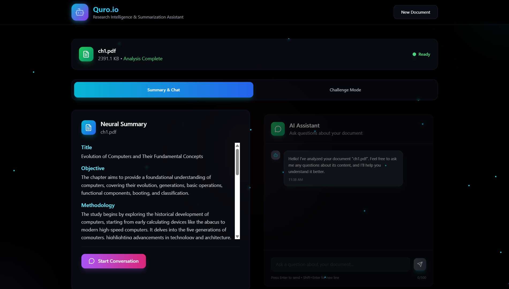
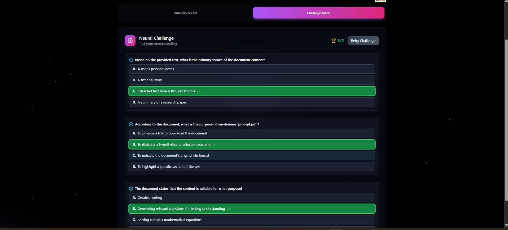

# 🤖 Quro.io: AI Research Assistant

~Prakhar Srivastava

> **An intelligent assistant that helps summarize, analyze, and question research papers — built using FastAPI & LLMs(Gemini and DeepSeek), with a sleek React frontend.**

---

## 🧠 Features

- 📄 Upload PDF research papers
- ✨ Get AI-generated **summaries** of the document
- ❓ Generate **challenge questions** and quiz-like insights
- 💬 Ask **free-form questions** based on document content
- ⚡️ Fast performance, even on large files
- 🖥️ Built to run on both **local** and **cloud (Render, Vercel)**

---

## 📸 Screenshots

> Add screenshots in this section after deployment or while running locally.
> https://www.youtube.com/watch?v=7bmckg5zy-E

| Upload PDF | Summary View |Challenge ME |
|------------|---------------|---------------|
|  |  |  |

---

## 🛠️ Tech Stack

| Technology    | Purpose                   |
|---------------|---------------------------|
| 🐍 Python + FastAPI | Backend REST API             |
| ⚡️ Uvicorn         | ASGI Server                   |
| 📚 PyMuPDF (`fitz`) | PDF Parsing                  |
| 🌐 React + Vite     | Frontend Framework           |
| 💬 Gemini Pro & DeepSeek V3      | AI Summarization + QA        |
| 🧪 Pydantic         | Data Validation              |
| 🧑‍💻 TailwindCSS     | UI Styling                   |
| 🧾 Render & Vercel  | Deployment Platforms         |

---

## 🚀 Setup Instructions

### 1. Clone the Repository

```bash
git clone https://github.com/prakhar-developer/quro.io
cd quro.io
```
---
### 2. 🖥 Backend (FastAPI)

```bash
cd backend
python -m venv .venv
source .venv/bin/activate  # Windows: venv\Scripts\activate
pip install -r requirements.txt
uvicorn main:app --reload
```
**Note :** create .env file
```env
GEMINI_API_KEY=your-gemini-key
HUGGINGFACEHUB_API_TOKEN=your-access-token
```
---

### 3. 🌐 Frontend (React)

```bash
 # or client if renamed
npm install
npm run dev
```
---
## 📁 Project Structure

```bash
quro.io/
├── backend/                # FastAPI backend
│   ├── routes/             # API route handlers
│   ├── utils/              # Utility functions (e.g., PDF parsing)
│   └── main.py
├── requirements.txt        # Python dependencies             # Entry point for FastAPI
├── src/
│   ├── components/         # React frontend components
│   └── App.tsx         # Root React component
├── README.md               # Project documentation
```
